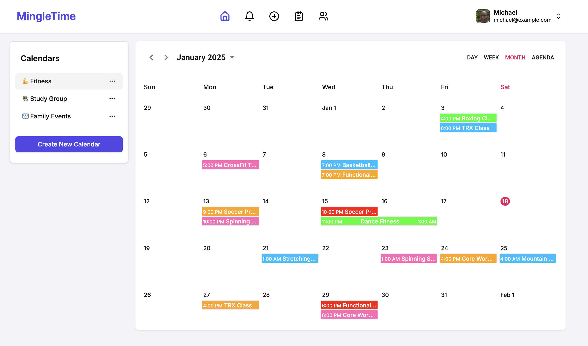
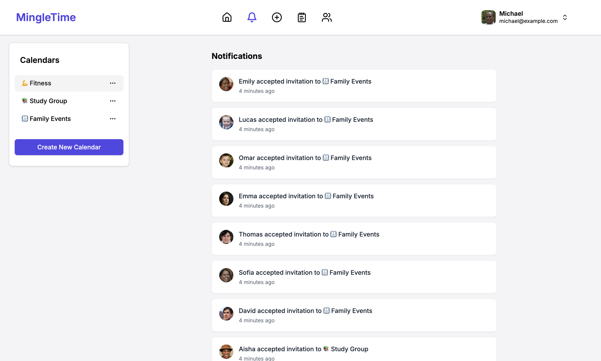
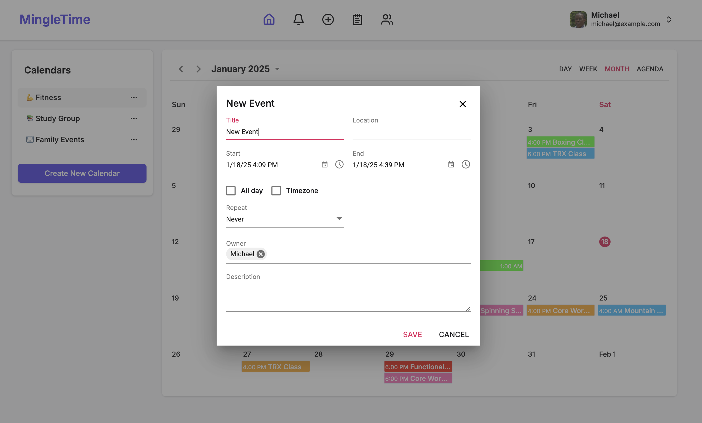
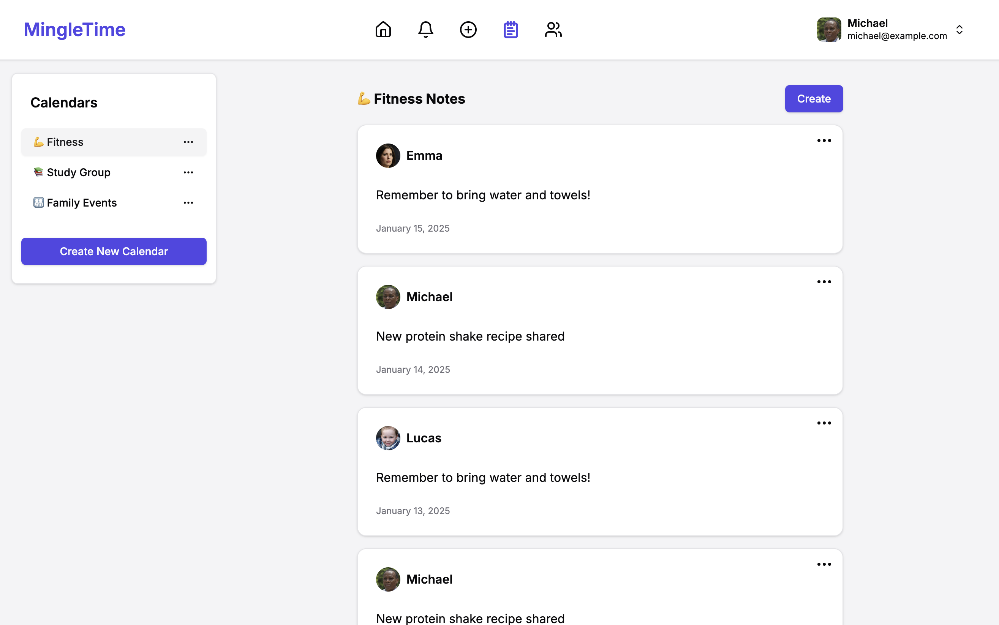
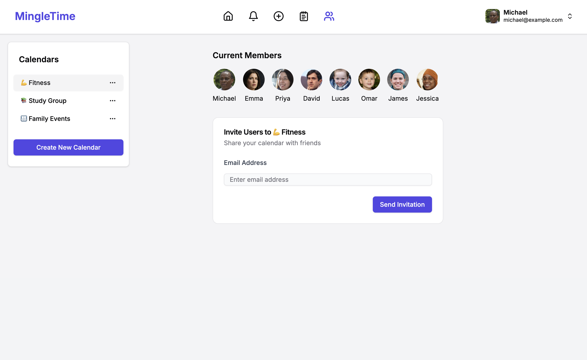
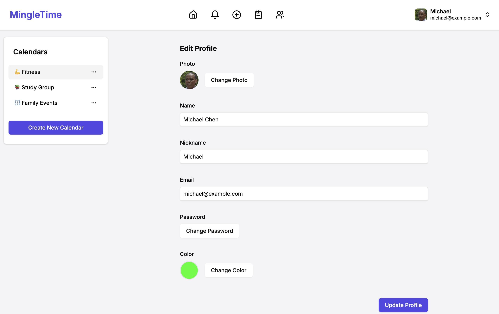

# Mingletime

Scheduling application built with Next.js, enabling efficient group calendar management and event coordination.

## Demo

Check out the live demo [here](https://mingletime.vercel.app/).

### Login Credentials

- **Username:** `michael@example.com`
- **Password:** `password`













## Features

- 📅 Interactive calendar interface
- 👥 Group event management
- 🔐 Secure authentication
- 📱 Responsive design
- 🎨 Modern UI with Shadcn/ui components

## Tech Stack

- **Framework**: Next.js 14
- **UI Components**:
  - Shadcn/ui
  - Tailwind CSS
- **Authentication**: NextAuth.js
- **Database**: Your database choice here. I'm using postgresql with rails api.
- **Deployment**: Vercel

## Getting Started

First, run the development server:

```bash
npm run dev
# or
yarn dev
# or
pnpm dev
# or
bun dev
```

Open [http://localhost:3000](http://localhost:3000) with your browser to see the result.

## Environment Variables

Create a `.env.local` file in the root directory with:

```env
NEXTAUTH_SECRET=your_secret_here
NEXTAUTH_URL=http://localhost:3000
NEXT_PUBLIC_API_URL=http://localhost:3001
GOOGLE_CLIENT_ID=your_google_client_id
GOOGLE_CLIENT_SECRET=your_google_client_secret
FACEBOOK_CLIENT_ID=your_facebook_client_id
FACEBOOK_CLIENT_SECRET=your_facebook_client_secret
SYNCFUSION_LICENSE=your_syncfusion_license
```

## Deployment

Deploy your app using [Vercel](https://vercel.com/new?utm_medium=default-template&filter=next.js&utm_source=create-next-app&utm_campaign=create-next-app-readme), the platform from the creators of Next.js.
